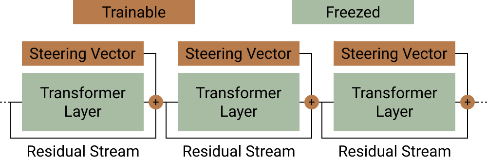
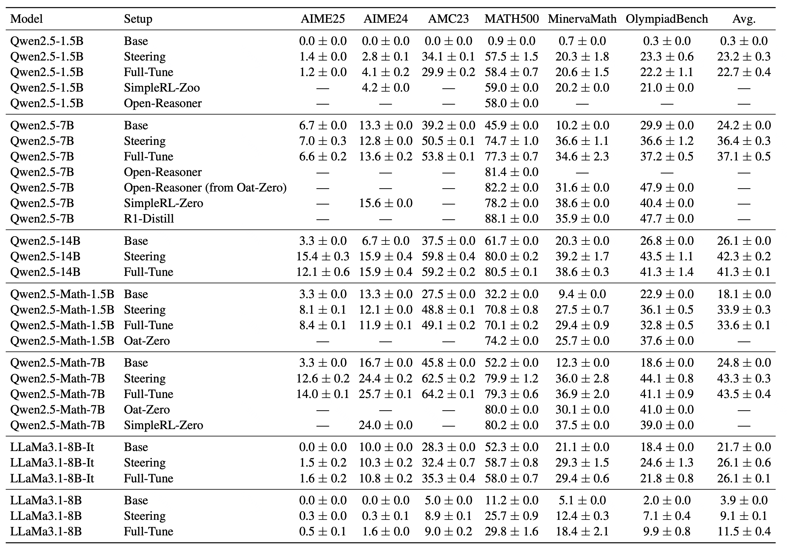

<h1 align="center">Steering Reasoning</h1>

[](LICENSE)
[](https://arxiv.org/abs/2505.18706)
[](https://arxiv.org/abs/2509.06608)



Training only steering vectors can match the performance of fully fine-tuned models trained with GRPO-style method. 



It’s substantially more efficient in memory use and training time. 

<div style="display:flex; justify-content:center; margin:0;">
  <table style="border-collapse:collapse; margin:0;">
    <thead>
      <tr>
        <th style="padding:6px 10px; border-bottom:1px solid #ccc; text-align:left;">Metric</th>
        <th style="padding:6px 10px; border-bottom:1px solid #ccc; text-align:center;">Full-Tune</th>
        <th style="padding:6px 10px; border-bottom:1px solid #ccc; text-align:center;">Steering</th>
      </tr>
    </thead>
    <tbody>
      <tr>
        <td style="padding:6px 10px; text-align:left;">Number of Parameters</td>
        <td style="padding:6px 10px; text-align:center;">14.7 B</td>
        <td style="padding:6px 10px; text-align:center;">245 K</td>
      </tr>
      <tr>
        <td style="padding:6px 10px; text-align:left;">Optimizer Memory</td>
        <td style="padding:6px 10px; text-align:center;">13.8 GB</td>
        <td style="padding:6px 10px; text-align:center;">240 KB</td>
      </tr>
      <tr>
        <td style="padding:6px 10px; text-align:left;">Per-step Time</td>
        <td style="padding:6px 10px; text-align:center;">9.94 s</td>
        <td style="padding:6px 10px; text-align:center;">0.11 s</td>
      </tr>
      <tr>
        <td style="padding:6px 10px; text-align:left;">Overall Time</td>
        <td style="padding:6px 10px; text-align:center;">52 m</td>
        <td style="padding:6px 10px; text-align:center;">34 s</td>
      </tr>
    </tbody>
    <caption style="caption-side:bottom; font-size:0.85em; margin-top:4px;">
      <em>Resource cost for Qwen2.5-14B—full fine-tuning vs. steering. Overall time is across 314 steps ≈ 1 epoch.</em>
    </caption>
  </table>
</div>

The resulting vectors are interpretable; see our paper, “[Small Vectors, Big Effects: A Mechanistic Study of RL-Induced Reasoning via Steering Vectors](https://arxiv.org/pdf/2509.06608)”, for details.

# How to Run

We explain below how to train, evaluate, visualize, and run the auxiliary experiments in this repo. All commands are intended to be run from the repository root.

## Training

### 1) Prepare model
**Model path:** place your base model under
  `/from_s3/models/<MODEL_NAME>`
  
* **Example:** `/from_s3/models/Qwen2.5-Math-7B`

### 2) Choose a training config

Set `CONFIG_PATH` environment variable. Configs live under `configs/train/rl/` and are organized by **model** and **dataset**.
File names correspond to the **setup type** (e.g., `steering.yml`).

* **Example:** Qwen2.5-Math-7B + DeepScaleR, steering vectors only
  `configs/train/rl/qwen2.5-math-7b/deepscaler/steering.yml`

### 3) Launch training

**Single node:**

```bash
bash /workspace/bin/train/rl/run_master.sh
```

**Multi-node (distributed):**

1. Set `IS_DIST=true` **on every node** (master and workers).
2. Start the master with:

   ```bash
   bash /workspace/bin/train/rl/run_master.sh
   ```
3. On each worker node, run:

   ```bash
   bash /workspace/bin/train/rl/run_worker.sh
   ```

**Outputs:** trained checkpoints are written to `train_output/`.

> **Note (steering setups):**
> The training scripts auto-detect `steering` setups and patch the `transformers` and `vllm` model code to enable a bias term on the MLP `down_proj` linear layer. This is done via:
>
> ```
> bin/helpers/modify_bias.sh
> ```

---

## Evaluation

1. Place the model to evaluate under:

   ```
   /from_s3/model/
   ```
2. Pick a config from:

   ```
   configs/eval/
   ```
3. Run vanilla evaluation:

   ```bash
   # Set whether the model uses steering vectors
   #   IS_STEERING=true  -> steering-vector models
   #   IS_STEERING=false -> LoRA or fully-tuned models
   IS_STEERING=true CONFIG_PATH=... bash bin/eval/vanilla/run_inner.sh
   ```

**Outputs:** results are written to `results/`.

### Additional evaluation scripts

Located in `bin/eval/`:

* `add_place` — Appendix C in *“Small Vectors, Big Effects: …”*
* `exchange_svs` — Section 9 in *“Small Vectors, Big Effects: …”*
* `magnitude` — *unpublished*
* `pair_single` — Appendix D in *“Small Vectors, Big Effects: …”*
* `patch_head` — Sections 6 & 7 in *“Small Vectors, Big Effects: …”*
* `patch_head_path` — *unpublished*

---

## Visualization

Put evaluation results in `results/`, then run the desired script from `bin/visualize/`:

* `accuracies_table` — Table 1 in *“Steering LLM Reasoning …”*
* `exchange_svs` — Table 1 in *“Small Vectors, Big Effects: …”*
* `layers` — Figures 1, 9, 10, 11 in *“Small Vectors, Big Effects: …”*
* `magnitude` — *unpublished*
* `pair_layers` — Figure 13 in *“Small Vectors, Big Effects: …”*
* `patch_head` — Figures 5, 20, 21 in *“Small Vectors, Big Effects: …”*
* `seed_alignment` — *unpublished*

---

## Other Experiments

`bin/metrics/` contains one-shot experiment scripts that evaluate and visualize in a single Python program:

* `add_place_steering` — *unpublished*
* `last_layer_steering` — Figures 3 & 19 in *“Small Vectors, Big Effects: …”*
* `logit_lens` — *unpublished*
* `pre_last_layer_steering` — Figure 6 in *“Small Vectors, Big Effects: …”*
* `self_explain` — *unpublished*
* `match_effect` — Figures 2, 4, 14, 15, 17, 18 in *“Small Vectors, Big Effects: …”*
* `lora1_plots` — Appendix S

---

## Extract Steering Vectors

To export a 2D matrix stacking single-layer steering vectors from a model **trained with steering vectors**:

```bash
# Model location for extraction
#   /from_s3/model/
bash bin/helpers/extract_steering_vectors.sh
# -> Saves outputs to: results/
```

Optionally merge single-layer vectors:

```bash
bash bin/helpers/merge_vectors_from_layers.sh
```

---

## Environment Variables (summary)

* `IS_DIST` — set to `true` on **all nodes** for distributed training.
* `IS_STEERING` — set to `true` when evaluating models trained with steering vectors; set to `false` for LoRA or fully-tuned models.
* `CONFIG_PATH` -- the path to the config file for training or evaluation.

## A Note on the Paths
The code expects models, eval results, and extracted steering vectors to follow a fixed directory structure. It’s formed in `steering_reasoning/train/rl/config.py` when setting `output_dir`. After running eval or extraction, keep the same stem as the trained model when uploading to your storage node. For example, 
- a trained model is saved to `.../trained_models/Qwen2.5-Math-7B/deepscaler/steering/seed-0/checkpoint-159/`;  
- eval results to `.../eval/Qwen2.5-Math-7B/deepscaler/steering/seed-0/checkpoint-159/temp_1.0_top_p_1.0/eval_seed-0/`;  
- and extracted steering vectors to `.../steering_vectors/Qwen2.5-Math-7B/deepscaler/steering/seed-0/checkpoint-159`.

If you don’t preserve this layout, some visualization and auxiliary scripts may fail.


# Acknowledgment
The initial implementation of the online training code was developed by [Alexey Malahov](https://github.com/alekseymalakhov11) and [Almaz Dautov](https://github.com/thehir0).

# Citing
```
@article{sinii2025steering,
  title={Steering LLM Reasoning Through Bias-Only Adaptation},
  author={Sinii, Viacheslav and Gorbatovski, Alexey and Cherepanov, Artem and Shaposhnikov, Boris and Balagansky, Nikita and Gavrilov, Daniil},
  journal={arXiv preprint arXiv:2505.18706},
  year={2025}
}

@article{sinii2025small,
  title={Small Vectors, Big Effects: A Mechanistic Study of RL-Induced Reasoning via Steering Vectors},
  author={Sinii, Viacheslav and Balagansky, Nikita and Aksenov, Yaroslav and Kurochkin, Vadim and Laptev, Daniil and Gerasimov, Gleb and Gorbatovski, Alexey and Shaposhnikov, Boris and Gavrilov, Daniil},
  journal={arXiv preprint arXiv:2509.06608},
  year={2025}
}
```
